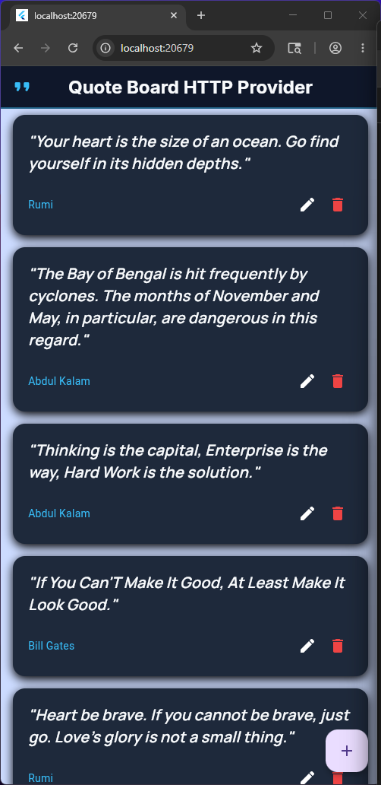
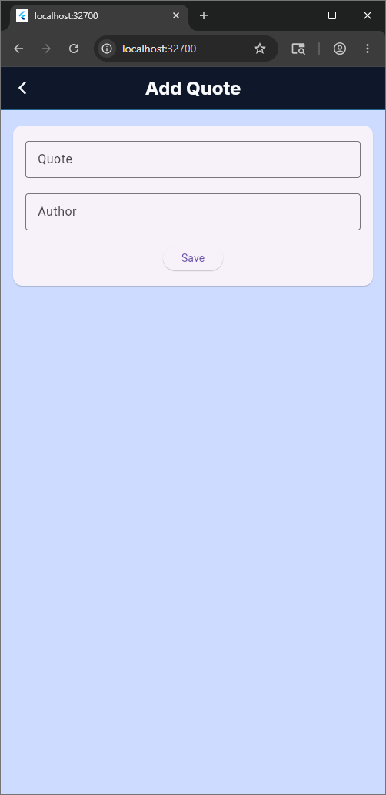
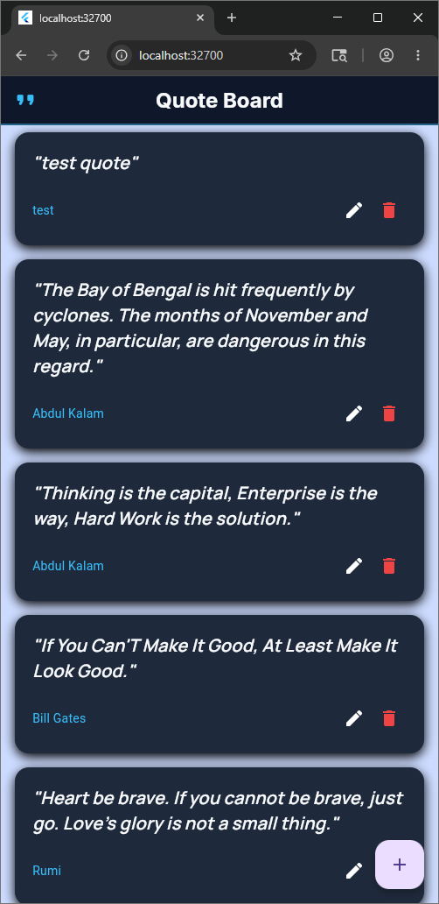
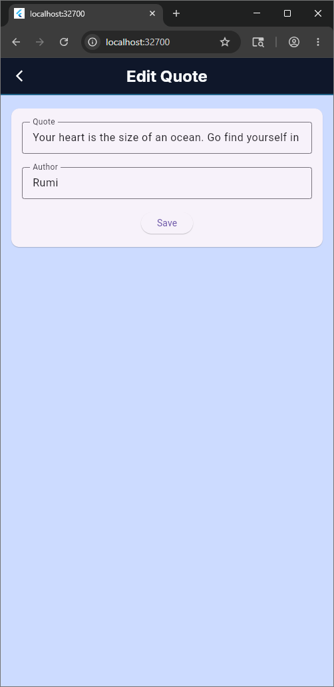
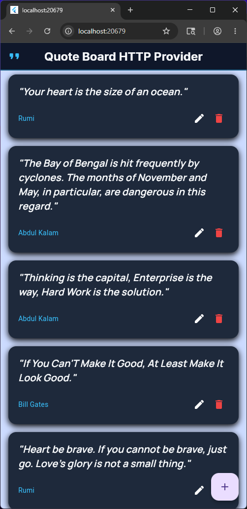
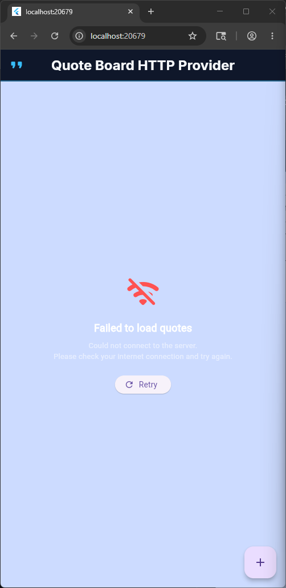

# Quote Board (HTTP Provider)

A Flutter application that displays quotes fetched from a remote API, allowing users to add, edit, and delete quotes.

## Features

- **Fetch Quotes**: Retrieves quotes from `https://dummyjson.com/quotes`.
- **Add Quotes**: Users can add new quotes with an author.
- **Edit Quotes**: Existing quotes can be updated.
- **Delete Quotes**: Quotes can be removed from the list.
- **Provider State Management**: Uses `provider` package for state management.
- **HTTP Requests**: Uses `http` package for API communication.
- **Caching**: Implements a simple cache to store quotes in memory.

## Getting Started

### Prerequisites

- Flutter SDK installed.
- An IDE (VS Code or Android Studio).

### Installation

1. Clone the repository:
   ```bash
   git clone <repository-url>
   cd quote_board_http_provider
   ```

2. Install dependencies:
   ```bash
   flutter pub get
   ```

### Running the App

```bash
flutter run
```

## Project Structure

```
lib/
├── models/
│   └── quote_model.dart      # Quote data model
├── providers/
│   └── quote_provider.dart   # State management with Provider
├── service/
│   └── quote_service.dart    # HTTP service for API calls
├── theme/
│   └── app_colors.dart       # App color definitions
├── widgets/
│   ├── app_bar.dart          # Custom app bar
│   └── quote_card.dart       # Reusable quote card widget
├── main.dart                 # App entry point
└── screens/
    ├── add_edit_quote_screen.dart  # Add/Edit quote screen
    └── home_screen.dart            # Home screen with quote list
```

## Usage

### Home Screen
- Displays a list of quotes fetched from the API.
- Includes an "Add Quote" button in the app bar.
- Each quote card has Edit and Delete buttons.

### Add/Edit Screen
- A form with two text fields: "Quote" and "Author".
- Save button to submit the changes.
- Navigates back to the home screen after saving.

## Dependencies

- `provider`: For state management.
- `http`: For making HTTP requests.
- `google_fonts`: For custom fonts.


## App Screenshots

### Home Screen


### Add Quote Screen




### Edit Quote Screen





### Delete Quote Screen


### Error Screen


## License

This project is licensed under the terms of the MIT license.

